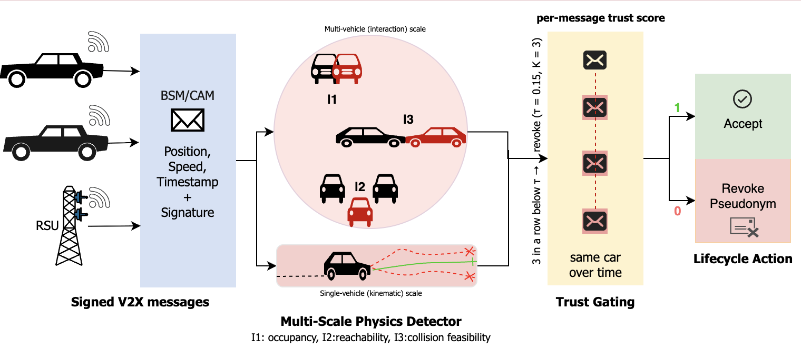

# PIAD-V2X: Physics-Informed Adaptive Defence for V2X

**Trust-Gated Pseudonym Lifecycle and Misbehaviour Detection**




PIAD-V2X is a framework for misbehaviour detection and pseudonym-level response in
V2X safety messaging. A multi-scale physics detector (single-vehicle kinematic
consistency and multi-vehicle interaction invariants) scores each broadcast safety
message, and a trust-gated pseudonym lifecycle neutralises and revokes senders whose
trust stays low. The multi-scale lifecycle runner is config-driven: its detector, trust gate, and evaluation are declared in `piad_v2x/hypes_yaml/` and selected with
--hypes_yaml. The remaining tools take their parameters on the command line.

## Installation

```bash
git clone https://github.com/ShaistaZeb/piad-v2x.git
cd piad-v2x
python3.13 -m venv .venv && source .venv/bin/activate
pip install -e .
```

## Data

The pipeline uses the public VeReMi Extension benchmark (Kamel et al., 2020;
CC-BY 4.0), which is not redistributed here. Download links are in
[`data/README.md`](data/README.md) and the schema in
[`docs/data_intro.md`](docs/data_intro.md). Extract the feature tables:

```bash
python piad_v2x/tools/veremi_extract.py --scenario DataReplay_1416 \
    --out data/features/DataReplay_1416.parquet
python piad_v2x/tools/build_mixed_table.py --out data/veremi.parquet
```

## Getting Started

Configurations live in `piad_v2x/hypes_yaml/` and are selected with `--hypes_yaml`.

```bash
# train the detector (--amp: CUDA mixed precision, inert on CPU)
python piad_v2x/tools/train.py --data data/veremi.parquet --amp

# closed-loop trust-gated lifecycle
python piad_v2x/tools/run_lifecycle_multiscale.py --hypes_yaml multiscale_rf.yaml

# inference on a trained model directory
python piad_v2x/tools/inference.py --model_dir checkpoints/

# tests
python -m unittest discover -s tests
```

A full walkthrough is in [`docs/pipeline_tutorial.md`](docs/pipeline_tutorial.md)
and the parameters in [`docs/config_tutorial.md`](docs/config_tutorial.md).

## Citation

```bibtex
@mastersthesis{zeb2026piadv2x,
  author = {Shaista Zeb},
  title  = {Physics-Informed Adaptive Defence for V2X: Trust-Gated Pseudonym Lifecycle and Misbehaviour Detection},
  school = {University of Wolverhampton},
  year   = {2026}
}
```

## License

Released under the [MIT License](LICENSE).

## Acknowledgement

Built on the VeReMi Extension dataset (Kamel et al., 2020) and the VEINS / F2MD
misbehaviour-detection simulators.
